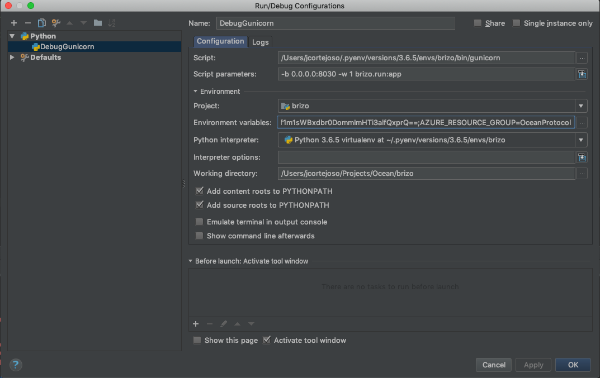

[](https://oceanprotocol.com)

# Brizo

> Helping publishers provide extended data services (e.g. storage and compute).
> [oceanprotocol.com](https://oceanprotocol.com)

___"🏄‍♀️🌊 Brizo is an ancient Greek goddess who was known as the protector of mariners, sailors, and fishermen.
She was worshipped primarily by the women of Delos, who set out food offerings in small boats. Brizo was also known as a prophet specializing in the interpretation of dreams."___

[](https://hub.docker.com/r/oceanprotocol/brizo/)
[](https://travis-ci.com/oceanprotocol/brizo)
[](https://app.codacy.com/project/ocean-protocol/brizo/dashboard)
[](https://pypi.org/project/ocean-brizo/)
[](https://github.com/oceanprotocol/brizo/graphs/contributors)

---

**🐲🦑 THERE BE DRAGONS AND SQUIDS. This is in alpha state and you can expect running into problems. If you run into them, please open up [a new issue](https://github.com/oceanprotocol/brizo/issues). 🦑🐲**

---

## Table of Contents

- [Features](#features)
- [Running Locally, for Dev and Test](#running-locally-for-dev-and-test)
- [API documentation](#api-documentation)
- [Configuration](#configuration)
- [Dependencies](#dependencies)
- [Code Style](#code-style)
- [Testing](#testing)
- [Debugging](#debugging)
- [New Version](#new-version)
- [License](#license)

---

## Features

In the Ocean ecosystem, Brizo is the technical component executed by the Publishers allowing them to them to provide extended data services (e.g. storage and compute). Brizo, as part of the Publisher ecosystem, includes the credentials to interact with the infrastructure (initially cloud, but could be on-premise).

## Running Locally, for Dev and Test

If you want to contribute to the development of Brizo, then you could do the following. (If you want to run a Brizo in production, then you will have to do something else.)

First, clone this repository:

```bash
git clone git@github.com:oceanprotocol/brizo.git
cd brizo/
```

Then run some things that Brizo expects to be running:

```bash
git clone git@github.com:oceanprotocol/barge.git
cd barge
bash start_ocean.sh --no-brizo --no-pleuston --local-spree-node
```

Barge is the repository where all the Ocean Docker Compose files are located. We are running the script `start_ocean.sh`: the easy way to have Ocean projects up and running.
We run without Brizo or Pleuston instances.

To learn more about Barge, visit [the Barge repository](https://github.com/oceanprotocol/barge).

Note that it runs an Aquarius instance and a MongoDB instance but Aquarius can also work with BigchainDB or Elasticsearch.

The most simple way to start is:

```bash
pip install -r requirements_dev.txt
export FLASK_APP=brizo/run.py
export CONFIG_FILE=config.ini
./scripts/wait_for_migration_and_extract_keeper_artifacts.sh
flask run --port=8030
```

That will use HTTP (i.e. not SSL/TLS).

The proper way to run the Flask application is using an application server such as Gunicorn. This allow you to run using SSL/TLS.
You can generate some certificates for testing by doing:

```bash
openssl req -x509 -newkey rsa:4096 -nodes -out cert.pem -keyout key.pem -days 365
```

and when it asks for the Common Name (CN), answer `localhost`

Then edit the config file `config.ini` so that:

```yaml
brizo.url = https://localhost:8030
```

Then execute this command:

```bash
gunicorn --certfile cert.pem --keyfile key.pem -b 0.0.0.0:8030 -w 1 brizo.run:app
```

## API documentation

Once you have Brizo running you can get access to the API documentation at:

```bash
https://127.0.0.1:8030/api/v1/docs
```

There is also some [Brizo API documentation in the official Ocean docs](https://docs.oceanprotocol.com/references/brizo/).

## Configuration

To get configuration settings, Brizo first checks to see if there is a non-empty environment variable named CONFIG_FILE. It there is, it will look in a config file at that path. Otherwise it will look in a config file named `config.ini`. Note that some settings in the config file can be overriden by setting certain environment variables; there are more details below.

See the [example config.ini file in this repo](config.ini). You will see that there are three sections: `[keeper-contracts]`, `[resources]` and `[osmosis]`.

### The [keeper-contracts] and [resources] Sections

The `[keeper-contracts]` and `[resources]` sections are used to configure squid-py.
Details about how to configure squid-py are in [the squid-py repo](https://github.com/oceanprotocol/squid-py#configuration).

**You can override the some squid-py-related settings in the config file by setting certain environment variables, such as KEEPER_URL. For details, see [the squid-py repo](https://github.com/oceanprotocol/squid-py#configuration).**

There is a parameter in the resources section called `validate.creator` that is setup false by default, that you have to switch to true in case that you wish to run a private marketplace.

### The [osmosis] Section

The `[osmosis]` section of the config file is where a publisher puts their own credentials for various third-party services, such as Azure Storage.
At the time of writing, Brizo could support files with three kinds of URLs:

- files in Azure Storage: files with "core.windows.net" in their URLs
- files in Amazon S3 storage: files with "s3://" in their URLs
- files in on-premise storage: all other files with resolvable URLs

Initial work has also been done to support Azure Compute but it's not officially supported yet.

A publisher can choose to support none, one, two or all of the above. It depends on which cloud providers they use.

If a publisher wants to store some files in Azure Storage (and make them available from there), then they must get and set the following config settings in the [osmosis] section of the config file. There is an [Ocean tutorial about how to get all those credentials from Azure](https://docs.oceanprotocol.com/tutorials/azure-for-brizo/).

```ini
[osmosis]
azure.account.name = <Azure Storage Account Name (for storing files)>
azure.account.key = <Azure Storage Account key>
azure.resource_group = <Azure resource group>
azure.location = <Azure Region>
azure.client.id = <Azure Application ID>
azure.client.secret = <Azure Application Secret>
azure.tenant.id = <Azure Tenant ID>
azure.subscription.id = <Azure Subscription>
; azure.share.input and azure.share.output are only used
; for Azure Compute data assets (not for Azure Storage data assets).
; If you're not supporting Azure Compute, just leave their values
; as compute and output, respectively.
azure.share.input = compute
azure.share.output = output
```

You can override any of those config file settings by setting one or more of the following environment variables. You will want to do that if you're running Brizo in a container.

```text
AZURE_ACCOUNT_NAME
AZURE_ACCOUNT_KEY
AZURE_RESOURCE_GROUP
AZURE_LOCATION
AZURE_CLIENT_ID
AZURE_CLIENT_SECRET
AZURE_TENANT_ID
AZURE_SUBSCRIPTION_ID
# Just always set AZURE_SHARE_INPUT='compute' for now
AZURE_SHARE_INPUT='compute'
# Just always set AZURE_SHARE_OUTPUT='output' for now
AZURE_SHARE_OUTPUT='output'
```

If a publisher wants to store some files in Amazon S3 storage (and make them available from there), then there are no AWS-related config settings to set in the config file. AWS credentials actually get stored elsewhere. See [the Ocean tutorial about how to set up Amazon S3 storage](https://docs.oceanprotocol.com/tutorials/amazon-s3-for-brizo/).

If a publisher wants to store some files on-premise (and make them available from there), then there are no special config settings to set in the config file. The only requirement is that the file URLs must be resolvable by Brizo. See [the Ocean tutorial about how to set up on-premise storage](https://docs.oceanprotocol.com/tutorials/on-premise-for-brizo/).

## Dependencies

Brizo relies on the following Ocean libraries:

- [squid-py](https://github.com/oceanprotocol/squid-py) handles all of the `keeper` interactions
- [osmosis-azure-driver](https://github.com/oceanprotocol/osmosis-azure-driver) mediates access to assets in Azure
- [osmosis-aws-driver](https://github.com/oceanprotocol/osmosis-aws-driver) mediates access to assets in AWS
- [osmosis-on-premise-driver](https://github.com/oceanprotocol/osmosis-on-premise-driver) mediates access to on-premise assets

## Code Style

Information about our Python code style is documented in the [python-developer-guide](https://github.com/oceanprotocol/dev-ocean/blob/master/doc/development/python-developer-guide.md)
and the [python-style-guide](https://github.com/oceanprotocol/dev-ocean/blob/master/doc/development/python-style-guide.md).

## Testing

Automatic tests are setup via Travis, executing `tox`.
Our tests use the pytest framework.

## Debugging

To debug Brizo using PyCharm, follow the next instructions:

1. Clone [barge](https://github.com/oceanprotocol/barge) repository.
2. Run barge omitting `brizo`. (i.e.:`bash start_ocean.sh --no-brizo --no-pleuston --local-nile-node`)
3. In PyCharm, go to _Settings > Project Settings > Python Debugger_, and select the option _Gevent Compatible_
4. Configure a new debugger configuration: _Run > Edit Configurations..._, there click on _Add New Configuration_
5. Configure as shown in the next image:

6. Set the following environment variables:

    ```text
    PYTHONUNBUFFERED=1
    CONFIG_FILE=config_dev.ini
    AZURE_ACCOUNT_NAME=<COMPLETE_WITH_YOUR_DATA>
    AZURE_TENANT_ID=<COMPLETE_WITH_YOUR_DATA>
    AZURE_SUBSCRIPTION_ID=<COMPLETE_WITH_YOUR_DATA>
    AZURE_LOCATION=<COMPLETE_WITH_YOUR_DATA>
    AZURE_CLIENT_SECRET=<COMPLETE_WITH_YOUR_DATA>
    AZURE_CLIENT_ID=<COMPLETE_WITH_YOUR_DATA>
    AZURE_ACCOUNT_KEY=<COMPLETE_WITH_YOUR_DATA>
    AZURE_RESOURCE_GROUP=<COMPLETE_WITH_YOUR_DATA>
    OBJC_DISABLE_INITIALIZE_FORK_SAFETY=YES
    ```

   The option `OBJC_DISABLE_INITIALIZE_FORK_SAFETY` is needed if you run in last versions of MacOS.
7. Now you can configure your breakpoints and debug brizo or squid-py.

## New Version

The `bumpversion.sh` script helps to bump the project version. You can execute the script using as first argument {major|minor|patch} to bump accordingly the version.

## License

```text
Copyright 2018 Ocean Protocol Foundation Ltd.

Licensed under the Apache License, Version 2.0 (the "License");
you may not use this file except in compliance with the License.
You may obtain a copy of the License at

   http://www.apache.org/licenses/LICENSE-2.0

Unless required by applicable law or agreed to in writing, software
distributed under the License is distributed on an "AS IS" BASIS,
WITHOUT WARRANTIES OR CONDITIONS OF ANY KIND, either express or implied.
See the License for the specific language governing permissions and
limitations under the License.
```
